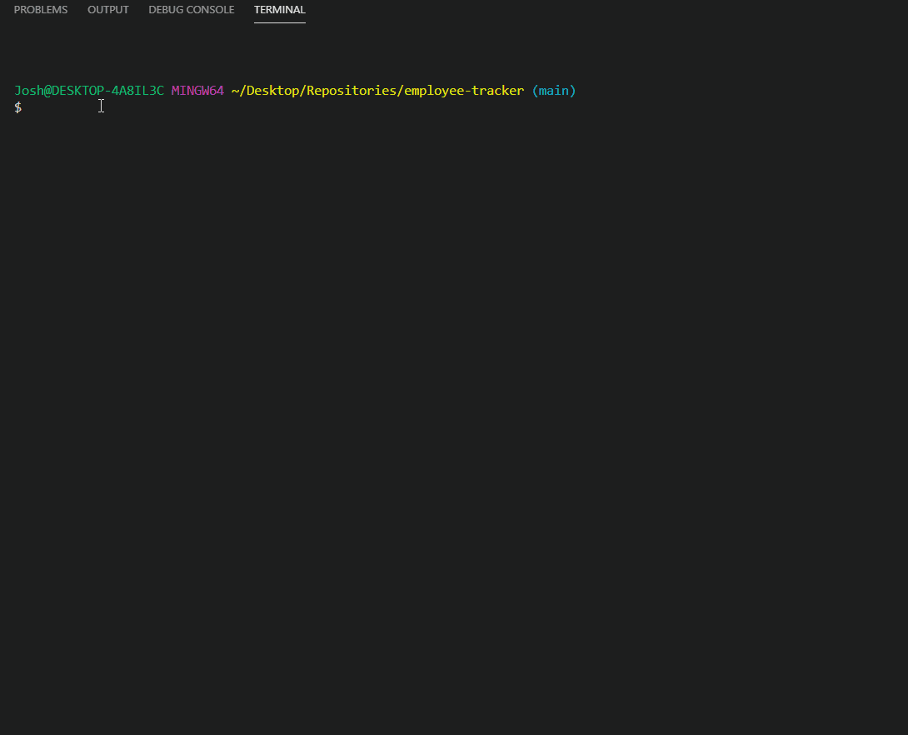

# Employee Tracker
[](https://www.mit.edu/~amini/LICENSE.md)
<br>
 Developers are often tasked with creating interfaces that make it easy for non-developers to view and interact with information stored in databases. Often these interfaces are known as Content Management Systems. This repository architects and builds a solution for managing a company's employees using node, inquirer, and MySQL.
  
 ## Built With
* JavaScript
* MySQL
* Node.js

## Dependencies
* [Inquirer.js (for all Users)](https://www.npmjs.com/package/inquirer)
* [MySQL](https://www.npmjs.com/package/mysql)
* [console.table](https://www.npmjs.com/package/console.table)

## Installation
To install dependencies run
```
npm install
```
To run node
```
node employee.js
```

To run database you must install MySQL and create a local server. Make sure your port, user, and password match. To create the compatible tables you must run the schema.sql file in your workbench.
You can include some provided table data by running the seeds.sql in your workbench as well.
Please make sure the following match your personal MySql information, and that the database is set to "employee_db".

```javaScript
var connection = mysql.createConnection({
  host: "localhost",

  port: 3306,

  user: "root",

  password: "password",
  database: "employee_db"
});
```

## Features
Employee Tracker uses Node.js to run inquirer prompts to grab team member info. Information is stored in a MySQL database where items can be created, viewed, updated, or deleted.
<br>



<br>

## Code Example
A dropdown menu to begin prompting with Inquirer in Node.js:

<br>  

```javaScript

function start(){ 
  inquirer.prompt({
    type: "list",
    message: "What do you want to do?",
    name: "start",
    choices: ["Add Department","Add Role","Add Employee","View Departments","View Roles","View Employees","Update Employee Role","Remove Employee","Quit"]
  })
  .then((res) => {
      switch (res.start) {
        case "Add Department":
          addDepartment();
          break;
        case "Add Role":
          addRole();
          break;
        case "Add Employee":
          addEmployee();
          break;
        case "View Departments":
          viewDepartment();
          break;
        case "View Roles":
          viewRoles();
          break;
        case "View Employees":
          viewEmployees();
          break;
        case "Update Employee Role":
          updateEmployee();
          break;
        case "Remove Employee":
          removeEmployee();
          break;
        case "Quit":
          console.log("Thanks for using Employee Tracker!")
          connection.end();
          break;
      }
    })
};

```

<br>
Add functions (one for Department,Role, and Employee) create new items in our database:
<br>

```javaScript

function addDepartment(){
  inquirer.prompt({
    type: "input",
    message: "Enter department name:",
    name: "newDepartment"
  })
  .then((res) => {
      connection.query("INSERT INTO department SET ?", {
        name: res.newDepartment
      });
      console.log("Department added");

      start();
    });
}

```
<br>
View functions (one for Department,Role, and Employee) allow us to view items in our database:
<br>

```javaScript

function viewDepartment(){
  connection.query(`SELECT * FROM  department`,(err,res) => {
    if (err) throw err;
      console.table(res);
      start();
    });
  
};
```
<br>
Update function to change employee role:

```javaScript
function updateEmployee(){
  connection.query("SELECT * FROM employee", function (err,responseEmp) {
    if (err) throw err;
    connection.query("SELECT * FROM role", function(err,responseRole){
      if (err) throw err;
    
    inquirer.prompt([
      {
        type: "list",
        message: "Which employee would you like to update?",
        name: "chooseEmployee",
        choices: function() {
          var employeeArray = [];
          for (var i = 0; i < responseEmp.length; i++) {
            employeeArray.push(`${responseEmp[i].first_name} ${responseEmp[i].last_name}`);
          }
          return employeeArray;
        }},
        {
          type: "list",
          message: "New Role:",
          name: "updateRole",
          choices: function() {
            var roleArray = [];
            for (var i = 0; i < responseRole.length; i++) {
              roleArray.push(responseRole[i].title);
            }
            return roleArray;
          }
        }
     ])
      .then((res)=>{
        let name = res.chooseEmployee.split(" ");
        let first = name[0];
        let last = name[1];

        var upRole;
      for (var i = 0; i < responseRole.length; i++) {
        if (responseRole[i].title === res.updateRole) {
          upRole = responseRole[i].id;
        }
      }
        connection.query("UPDATE employee SET ? WHERE ? AND ?", [
            {
              role_id: upRole
            },
            {
              first_name: first
            },
            {
              last_name: last
            }        
          ],

          function (err, res) {
            if (err) throw err;
            console.log("Employee has been updated.")
            start();
            return res;
          }
        ) 
        
      })   
    })
  })
}
```
<br>
Function to remove an employee from database:

```javaScript
function removeEmployee(){
  connection.query("SELECT * FROM employee", function (err,response) {
    if (err) throw err;
    inquirer.prompt([
      {
        type: "list",
        message: "Which employee would you like to remove?",
        name: "chooseEmployee",
        choices: function() {
          var employeeArray = [];
          for (var i = 0; i < response.length; i++) {
            employeeArray.push(`${response[i].first_name} ${response[i].last_name}`);
          }
          return employeeArray;
        }},
     ])
    .then((res)=>{
      let name = res.chooseEmployee.split(" ");
      let first = name[0];
      let last = name[1];

      connection.query("DELETE FROM employee WHERE ? AND ?", [
          {
            first_name: first
          },
          {
            last_name: last
          }        
        ],

        function (err, res) {
          if (err) throw err;
          console.log("Employee has been removed.")
          start();
          return res;
        }
      ) 
    })   
  })
}
```

<br>
<br>

# Repository Link:
https://github.com/joshglugatch/employee-tracker

<br>

### Author:
Josh Glugatch  

[](https://github.com/joshglugatch)
<br>
[](www.linkedin.com/in/joshua-glugatch)


